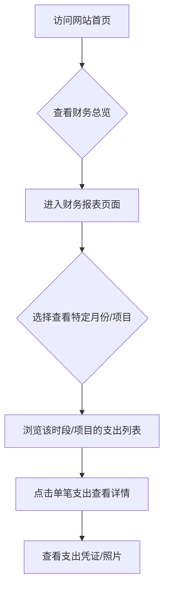
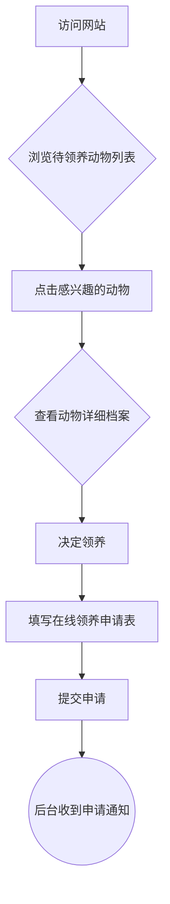

# 宠物救助网站项目规格

## 1. 项目目标

建立一个公开透明的宠物救助信息平台，旨在记录并公示所有捐款和相关的救助支出，让每一位关心流浪动物的人都能看到善款的实际用途。

### 阶段性目标
- **第一阶段：** 核心功能是财务透明化。为捐款人提供清晰、可追溯的捐款使用报告。
- **第二阶段：** 扩展为综合性救助平台。增加流浪动物档案、在线领养申请等功能，连接救助资源与领养家庭。

---

## 2. 第一阶段：财务透明模块

### 2.1 核心用户流程

我们的首要目标是让捐款人可以轻松地查看资金流向。

### 2.2 页面设计（初稿）

#### a. 首页 (Home)
- **财务总览卡片：** 显眼地展示核心财务数据，如“本月总收入”、“本月总支出”、“当前余额”。
- **导航入口：** 清晰的按钮或链接，引导用户进入完整的“财务报表”页面。

#### b. 财务报表页 (Financial Report)
- **数据筛选：** 提供按月份、按项目（如：猫粮、医疗、绝育）筛选的功能。
- **收支列表：** 以列表形式展示每一笔收支记录，包含日期、摘要、金额、分类。
- **可视化图表：** 用一个简单的饼图或柱状图展示各支出分类的占比。

#### c. 支出详情 (Expense Detail)
- **详细信息：** 展示单笔支出的所有细节。
- **凭证展示：** 显示上传的票据照片或相关截图。

### 2.3 数据模型 (Data Models)

为了实现上述功能，我们需要定义以下数据结构：

**a. 收入/捐款 (Income)**
- `id`: 唯一标识符
- `timestamp`: 捐款时间
- `amount`: 金额
- `donor_name`: 捐款人姓名 (可匿名)
- `message`: 捐款人留言 (可选)
- `payment_method`: 支付方式 (如：微信、支付宝)

**b. 支出 (Expense)**
- `id`: 唯一标识符
- `timestamp`: 支出时间
- `amount`: 金额
- `description`: 支出描述
- `category_id`: 关联到支出分类
- `receipt_url`: 凭证照片的链接

**c. 支出分类 (ExpenseCategory)**
- `id`: 唯一标识符
- `name`: 分类名称 (如: 猫粮狗粮, 医疗费, 绝育手术)

---

## 3. 第二阶段：动物档案与领养模块

### 3.1 核心用户流程

此阶段的目标是为待领养的动物建立档案，并提供一个简单的在线申请流程。

### 3.2 页面设计（初稿）

#### a. 动物列表页 (Animals List)
- **筛选/搜索：** 提供按动物类别（猫/狗）、年龄、性别等筛选功能。
- **动物卡片：** 每个动物以卡片形式展示，包含照片、名字、基本信息（如“已绝育”）。

#### b. 动物详情页 (Animal Profile)
- **照片集：** 展示动物的多张生活照。
- **详细信息：** 名字、品种、年龄、性别、健康状况（疫苗、绝育情况）、性格描述、救助故事等。
- **领养按钮：** 一个醒目的“申请领养”按钮，链接到申请表。

#### c. 领养申请页 (Adoption Form)
- **申请须知：** 清晰列出领养条件和流程。
- **申请表单：** 包含申请人信息（姓名、联系方式、住址）、家庭情况、养宠经验等。

### 3.3 数据模型 (Data Models)

**a. 动物 (Animal)**
- `id`: 唯一标识符
- `name`: 名字
- `species`: 物种 (猫/狗)
- `breed`: 品种
- `age`: 年龄
- `gender`: 性别
- `status`: 状态 (如: 待领养, 已领养)
- `health_info`: 健康信息 (疫苗, 绝育)
- `description`: 性格/故事描述
- `photos`: 照片链接列表

**b. 领养申请 (AdoptionApplication)**
- `id`: 唯一标识符
- `animal_id`: 关联到动物
- `applicant_name`: 申请人姓名
- `contact_info`: 联系方式
- `address`: 地址
- `application_text`: 申请陈述
- `status`: 申请状态 (如: 待审核, 已通过, 未通过)
- `timestamp`: 申请提交时间
